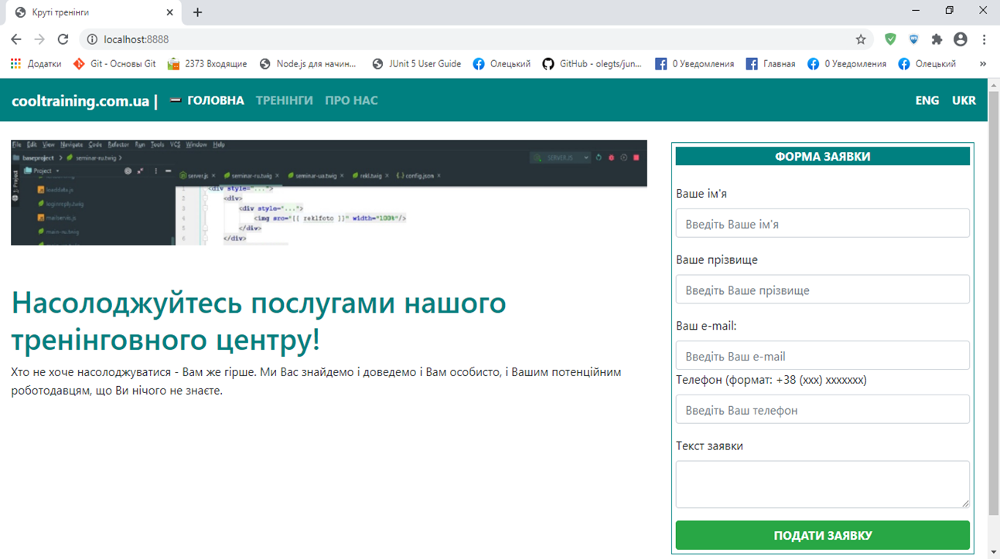
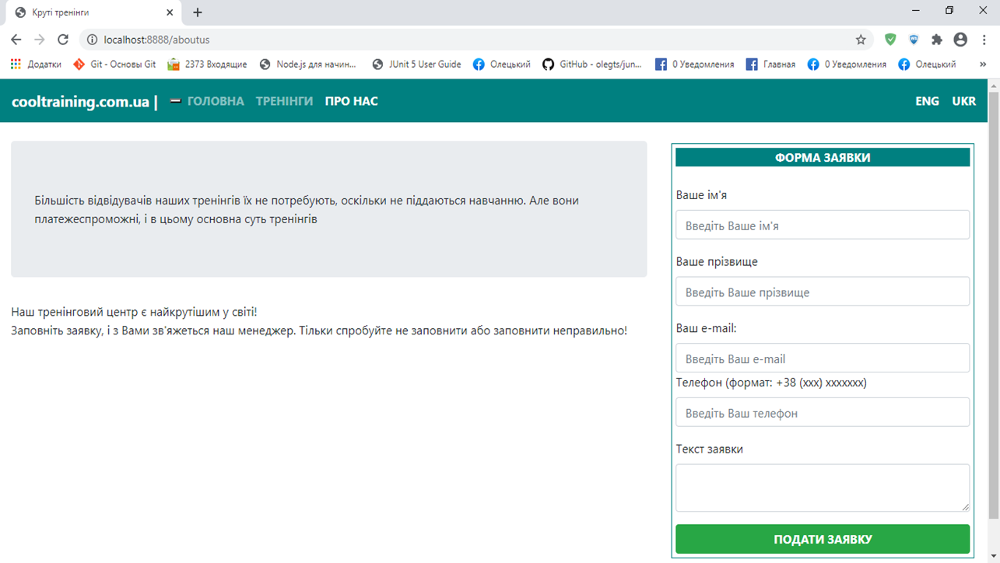
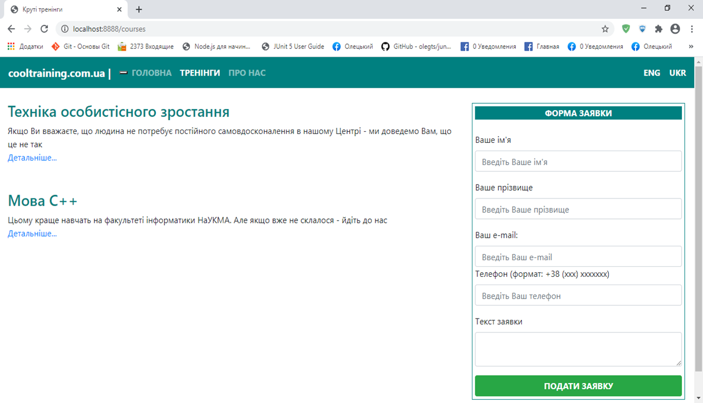

# Cool Site

A web app that provides functionality to list trainings and let users sign up for them.

It features:
-  a microservice architecture (Docker Compose), which consists of 3 services (api, web and mail);
-  an awesome JS front-end that uses Bootstrap styles, React components, Pug templates and Express routing;
-  a stunning Express back-end with DAO/Service/Controller architecture, MySQL database and migrations;
-  a pretty mediocre mail server that sends confirmation emails to users that signed up for a training;
-  an administrator's interface, which lets admins do whatever they want with applications and trainings, but requires them to sign in.

## Task Specification

### Layout

Create a site, each page of which is built on the following prototype:

-  Use of Twitter Bootstrap and an arbitrary template engine is mandatory.
-  Separate templates for the menu and main content must be implemented, which are connected to the main template.
-  The active menu item must be highlighted accordingly.
-  Implement menu items using a loop in the template.
-  "Home" and "About" pages should display some static information ("Home" was above, "About" may look like this):

-  "Trainings" page should display a list of trainings stored in the database - its name and a short advert:

-  Clicking on "See more…" button a more detailed description of the selected training should be displayed.
-  To display trainings (both in short and full form) use Vue or React.
-  Each training must correspond to \<training-short\> or \<training-full\> elements; provide components for their processing.

-  The site must support Ukrainian and English. Accordingly, there should be versions of the pages in different languages.

### Registration form

-  The registration form should allow the user to fill in the application.
-  If the first or last name fields are not filled in, the message "First/Last name cannot be empty" should be displayed. If the e-mail is invalid, the message "E-mail is invalid" should be displayed. If the phone number does not match the desired format, the message "Phone is invalid" should be displayed. It is recommended to use regular expressions to check phone number format. If the application text is empty, the message "Text field cannot be empty" should be displayed.
-  If the form is filled in incorrectly, the data should not be sent to the server.

-  An administrator must be able to set a mode that requires standard email confirmation based on an email letter to the user. This mode is set in the configuration file. In this mode, the user should see an appropriate message. After confirmation the user must receive an email about accepting their application.
-  If the confirmation mode is not set, the message that the application was accepted should be displayed immediately (the site page should not be hidden).

### Admin UI

-  An administrator should be provided with a separate interface for viewing and deleting applications, as well as adding new trainings.

### Back-end

-  Server side should be based on Node.js and Express.
-  Applications must be stored in a database (MySQL or MongoDB).
-  The name of the site, its domain name, names of images, menu color, menu items and confirmation mode should be read from the configuration file (config.json).

-  The project must have microservice architecture.
